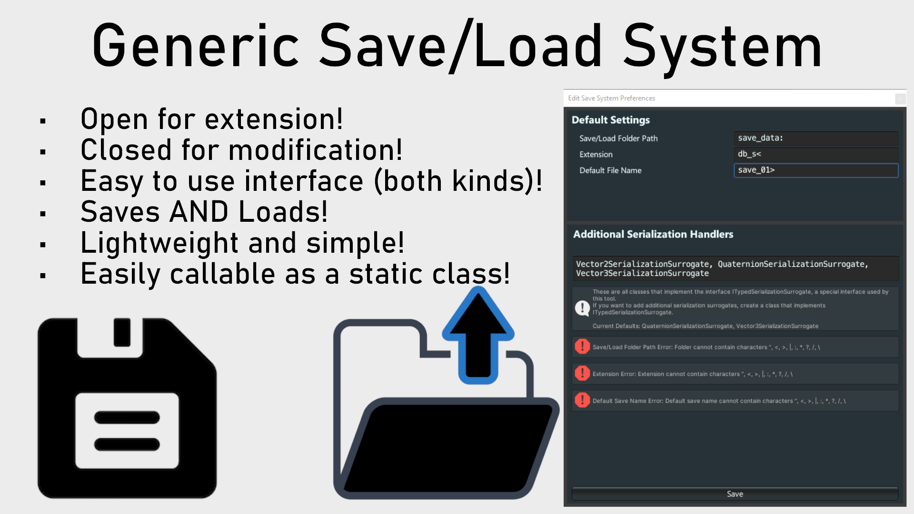
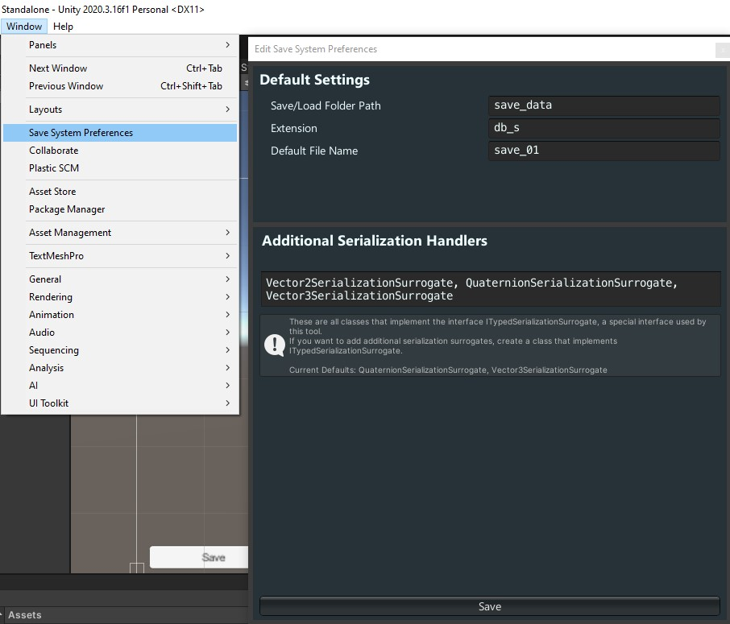
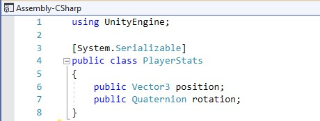
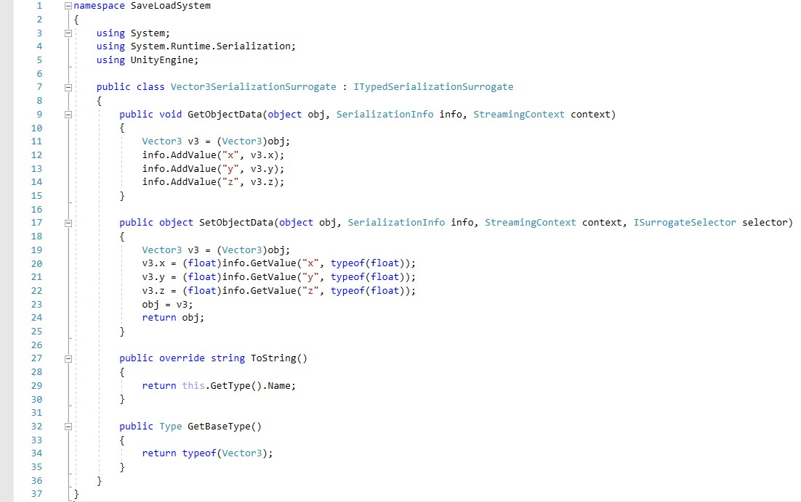

# Generic Save/Load Tool
_Verified to work with Unity 2020.3.16f1_

The 'Generic Save/Load Tool' (as I've taken to calling it) is an easily extensible static library with only a few configurable bits. Its main claim to fame is that it automatically aggregates any classes the implement the `ITypedSerializationSurrogate` interface (part of the tool, it is an interface extends from `ISerializationSurrogate` but requires one extra function) and registers them as serialization surrogates for the binary deserializer it uses.

## Installation
See that Releases tab over on the right of the main page of this repository? Click that, download the latest one and import it as you would with any other `.unitypackage`. Once you've done that, a new item in the Window tab will be available in your Unity editor: **Save System Preferences**.

Clicking **Save System Preferences** will open up a small window that allows you to tweak the defaults of the tool, as well as see which classes it is picking up that implement `ITypedSerializationSurrogate`.

## Tutorial

Pictured here is the tool's location in the `Window` tab as well as its general layout.  
The `Save/Load FolderPath` is where in your `Application.PersistentData` you want save data be stored.  
The `Extension` is what extension should be tacked onto the end of your save data.  
Lastly, the `Default File Name` is what your file gets named if you don't provide a file name for input for save/load operations.  
The `Additional Serialization Handlers` section at the bottom is more diagnostic than anything. It lists which classes it has picked up that have implemented `ITypedSerializationSurrogate`. Should you need to serialize/deserialize something slightly more complex than a Vector3, you'll likely want to write your own `ITypedSerializationSurrogate` and make sure it gets picked up here (which should be automatic, on compile time).

Once you've configured the tool, there are only a few caveats left.

1. Classes that you want to save out must be marked as `[System.Serializable].` You absolutely cannot just serialize/deserialize your player script itself, you need a wrapper object.

2. Classes that you want to save out should NOT be Monobehaviors. Really, most game objects cannot be serialized (Transforms require an active game object, before you even _think_ about writing a custom serialization surrogate).
3. If you want anything to be serialized "automatically" outside of `Vector3` and `Quaternion`, you'll need to write a custom `ITypedSerializationSurrogate` for it.

With those out of the way, there are two functions that you can call in this tool. They are...

##### bool SaveLoadSystem.SerializationManager.Save(object saveData, [string saveName = null])
A very simple method, this saves `saveData` out into a file, either one you defined through the defaults, or one you define by passing in `saveName`. If the operation fails, the serialization process will _gracefully_ fail and return false, otherwise the function returns true.

##### object SaveLoadSystem.SerializationManager.Load([string saveName = null])
Much like the previous method, this one is also very simple, it reads the file specified by the `saveName` parameter or your preset defaults. If it can read what's there, it returns the object. Otherwise, it also _gracefully_ fails and returns null.

Additionally, there's an interface you can extend from, should you need to create new serialization handlers.
##### SaveLoadSystem.ITypedSerializationSurrogate

`ITypedSerializationSurrogate` isn't much more complex than what it inherits from (`ISerializationSurrogate`) and adds a single additional method to implement, `public Type GetBaseType()` which just returns the `typeof()` of what the surrogate is intended to serialize/deserialize. Otherwise, the implementation is no different than the base interface which it inherits from.

Serialization/deserialization is a complex process (and C# makes it far easier than it should be) and I wouldn't suggest just writing up a new `ITypedSerializationSurrogate` at the first sign of needing something to be saved out. Instead, try to break the object down into _only_ the parts you need to be there on save/load. Otherwise, you'll end up with one hell of a headache.
